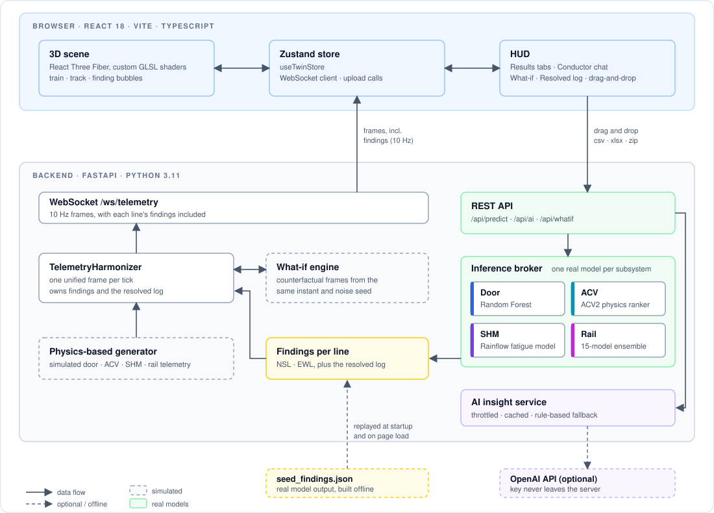
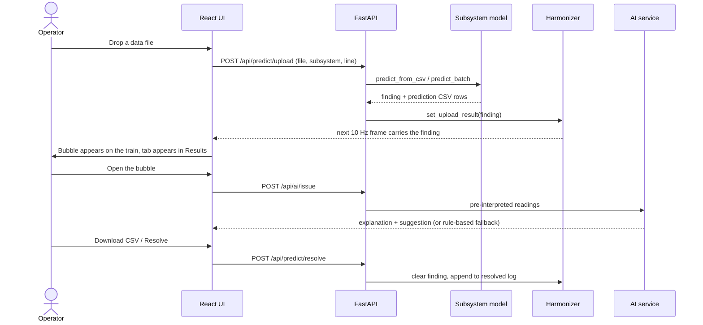

<h1 align="center">NebulaX P3 — Train Condition Monitoring</h1>

<p align="center">
  
  
  
  
</p>

<p align="center">
  <a href="https://smrt-digital-twin-2026.web.app/"><strong>Live Demo: smrt-digital-twin-2026.web.app</strong></a>
</p>

An interactive 3D train that turns raw maintenance data into **clear actions**. Drag a data file onto it, and the fault shows up as a bubble on the exact component that needs attention, with an explanation a non-engineer can read and trust.

Built for the **LTA NebulaX 2026 Hackathon — Problem Statement 3 (Train Condition Monitoring)**, on a Singapore MRT **North-South** and **East-West** line.

```
  raw sensor file  ──►  subsystem model  ──►  finding on the train  ──►  explanation · fix · download
  (csv · xlsx · zip)    (one per subsystem)    (bubble on the part)      (Resolve when it's done)
```

## What it does

Four subsystems, each with its own model and its own PS3 prediction format:

| Subsystem | You upload | Model | You get back |
|---|---|---|---|
| **Air conditioning (ACV)** | A consist case workbook (`.xlsx`) | ACV2 physics-based ranker: six evidence groups, calibrated against a null distribution | All eight cars ranked most → least likely to have a refrigerant leak (`03\|01\|05\|…`) |
| **Passenger doors** | A continuous door stream (`.csv`) | Random Forest on 210 features across 16 channels; cycles found from timestamp gaps | Every open/close cycle labelled `Normal` or `Abnormal resistance`, with start/end times |
| **Structural health (SHM)** | A bogie vibration recording (`.csv`) | Calibrated Rainflow fatigue model (ASTM E1049-85) + Welch PSD | A cumulative-damage value, plus bearing-risk and spectrum readouts |
| **Rail corrugation** | A 128-channel vibration run (`.csv`) | 15-estimator ensemble on 252 features, with class-specific thresholds for the rare `Side I` class | `Normal`, `Side I` or `Side II`, with depth and grinding priority |

Every result is also available as the **exact prediction CSV** the competition asks for (`acv_predictions.csv`, `door_predictions.csv`, `shm_predictions.csv`, `rail_predictions.csv`), built by the backend so the download is the model's output, not a re-derivation.

### On screen

- **Findings on the train.** Each unresolved upload is a bubble anchored to the part it concerns. Click it for a card with an **explanation**, a **suggested repair**, and a link to the full charts. The text types out as it arrives.
- **Explainable by design.** The AI is given pre-interpreted readings (value, threshold, verdict), so it can't invent its own idea of "normal" or contradict the dashboard. It explains the model's result in plain language; it doesn't make the diagnosis.
- **Results panel.** One tab per unresolved upload, each with its breakdown and a download button. Resolve a finding and its tab disappears.
- **Drag and drop.** Drop a file (or a ZIP of runs) onto the Conductor's upload dialog.
- **Resolve and log.** Resolving clears the bubble and writes a receipt to the resolved log.
- **Conductor.** A chat assistant grounded in the live readings and your latest uploads.
- **Simple / Expert toggle.** Plain wording ("Wheel shaking") or engineering terms ("Axle-box vibration RMS"); every reading has a **?** tooltip. Definitions live in [`frontend/src/lib/metricGlossary.ts`](frontend/src/lib/metricGlossary.ts).

## Architecture

<p align="center">
  
</p>

There are two data paths, joined in the `TelemetryHarmonizer`:

1. **Live stream (simulated).** A physics-based generator produces synchronised door / ACV / SHM / rail telemetry at 10 Hz. The harmonizer aligns it into one frame, evaluates it twice (with and without the operator's maintenance actions, same noise seed) for the what-if comparison, and broadcasts it over the WebSocket.
2. **Uploads (real models).** A file goes through REST to the matching subsystem model. The result, a *finding*, is stored per line and rides along on the next frames as `uploads_by_line`, which is how the bubbles and the Results panel stay in sync without any extra polling.



### Deployment

The live application is hosted at **[smrt-digital-twin-2026.web.app](https://smrt-digital-twin-2026.web.app/)**.

The frontend is a static Vite build on **Firebase Hosting**; its `/api/**` rewrite forwards to the backend, a container built from [`backend/Dockerfile`](backend/Dockerfile) and run on **Cloud Run** (`asia-southeast1`).

## Quick start

**Prerequisites:** Python 3.11+, Node.js 18+.

```sh
# 1. Backend (from the repo root)
python -m venv venv
source venv/bin/activate            # Windows: .\venv\Scripts\activate
pip install -r backend/requirements.txt
python -m uvicorn backend.main:app --host 0.0.0.0 --port 8000 --reload
```

```sh
# 2. Frontend (new terminal)
cd frontend
npm install
npm run dev                          # http://localhost:3000
```

Vite proxies `/api` to `localhost:8000`, and the app opens its WebSocket to `ws://localhost:8000/ws/telemetry`.

### Optional: AI explanations

```sh
cp backend/.env.example backend/.env    # then add your OPENAI_API_KEY
```

The key is read only by the backend and never reaches the browser. **With no key, an exhausted quota or an API error, a deterministic rule-based explanation is used and labelled as such** — the app degrades in quality, never in availability.

### Try it

1. Open <http://localhost:3000>. The NSL train already carries four bubbles (see [baseline data pipeline](#baseline-data-pipeline-prototype)).
2. Click a bubble for its card, or open the **Results** panel on the right and switch tabs.
3. Click **Upload new data**, choose a subsystem, and drop a file. Uploads take `.csv`, `.xlsx`, `.xls` or a `.zip` of several runs, up to 30 MB.
4. Download the prediction CSV from the Results panel, then **Resolve** the finding.

## Baseline data pipeline (prototype)

To reflect an operational maintenance depot rather than an empty dashboard on boot, the system prototypes an **established ingest pipeline**: realistic historical inspection runs from the PS3 dataset splits are pre-processed offline through the subsystem models, with outputs structured into [`backend/model_data/seed_findings.json`](backend/model_data/seed_findings.json). 

The backend streams this baseline data through the exact same ingestion and validation code path used by live sensor uploads. Downstream services (3D spatial mapping, AI diagnostic cards, operator resolve workflow, audit logging) behave identically across both automated depot telemetry and manual file uploads.

```sh
python -m backend.scripts.build_seed_findings          # re-ingest and process runs through subsystem models
curl -X POST http://localhost:8000/api/predict/seed    # reset pipeline to baseline state after resolving findings
```

| Env var | Default | Effect |
|---|---|---|
| `SEED_DEMO_FINDINGS` | `1` | `0` disables initial pipeline findings, booting to a clean state until incoming uploads arrive |
| `SEED_DEMO_LINES` | `NSL` | Comma-separated transit lines initialized on startup, e.g. `NSL,EWL` |

The `PS3/` raw sensor datasets are git-ignored and not bundled in a fresh clone. They are only required when re-running the offline ingest pipeline, never for runtime serving.

## Repository layout

| Path | What it is |
|---|---|
| [`backend/`](backend/) | FastAPI service: REST + WebSocket, the four models, the harmonizer, the what-if engine and the AI service |
| [`frontend/`](frontend/) | React + Three.js app (Vite, Tailwind, Zustand, ECharts) |
| [`ACV2/`](ACV2/) | The ACV reference implementation, with its own CLI, methodology and reports; the backend adapts it |
| [`Door/`](Door/), [`SHM/`](SHM/), [`Rail_Corrugation/`](Rail_Corrugation/) | Training pipelines, audit notes and evaluation scripts for each subsystem |
| `PS3/` | Hackathon specification, datasets and example submissions (git-ignored) |

### Backend

| File | Role |
|---|---|
| `backend/main.py` | App entry point; starts the 10 Hz broadcast loop and seeds findings |
| `backend/api/routes.py` | REST endpoints (upload, resolve, AI, what-if, log) |
| `backend/api/websocket_streamer.py` | Full-duplex WebSocket manager |
| `backend/core/harmonizer.py` | Builds the unified frame; owns findings per line and the resolved log |
| `backend/models/door_model.py`, `acv_model.py`, `shm_model.py`, `corrugation_model.py` | The four subsystem models |
| `backend/models/inference_broker.py` | Runs the models on live frames; computes the fleet health index |
| `backend/models/submission.py` | Builds each subsystem's PS3 prediction CSV |
| `backend/services/whatif_engine.py` | Counterfactual simulation |
| `backend/services/ai_insight.py` | Plain-language explanations and Q&A |
| `backend/scripts/build_seed_findings.py` | Offline generator for the seeded findings |

### Frontend

| File | Role |
|---|---|
| `src/components/canvas/` | 3D scene: train, track corridor, GLSL shaders, and `InspectionTag.tsx` (bubbles and cards) |
| `src/components/hud/ResultsPanel.tsx` | Per-upload tabs, breakdowns and CSV download |
| `src/components/hud/conductor/` | Upload dialog (drag and drop), chat and onboarding |
| `src/store/useTwinStore.ts` | Global state, WebSocket client, upload calls |
| `src/lib/downloadCsv.ts` | Saves a finding's prediction CSV |

## API

| Method | Path | Purpose |
|---|---|---|
| `POST` | `/api/predict/upload` | Score a file or ZIP for one subsystem on one line |
| `GET` | `/api/predict/latest` | Current unresolved findings per line |
| `POST` | `/api/predict/resolve` | Clear a finding and log it |
| `POST` | `/api/predict/seed` | Restore the seeded demo findings |
| `GET` | `/api/log` | The resolved log |
| `POST` | `/api/ai/issue` · `/api/ai/insight` · `/api/ai/ask` | Card copy, live insight, free-text Q&A |
| `GET` · `POST` | `/api/whatif/actions` · `/api/whatif` · `/api/whatif/reset` | Maintenance-action sandbox |
| `GET` | `/api/health` · `/api/metrics/glossary` | Health check; the thresholds the UI mirrors |
| `WS` | `/ws/telemetry` | 10 Hz frames; accepts `playback`, `seek`, `whatif` and `reset_whatif` |

## Design notes

- **One source of truth for verdicts.** `GOOD` / `WATCH` / `ACTION_NEEDED` come from `METRIC_THRESHOLDS` in `backend/core/config.py`, and the frontend glossary mirrors them, so the words and colours in the UI can't contradict the backend.
- **The AI explains; it doesn't diagnose.** The model gets pre-interpreted readings. Calls are throttled and cached on a coarse fingerprint, so a 10 Hz stream never becomes 10 model calls a second.
- **The download is the model's output.** Each model builds its own submission rows at prediction time; the UI only serialises them. Door files without usable timestamps have no submission CSV rather than a made-up one.
- **Counterfactuals are measured, not estimated.** A frame is evaluated twice from the same instant and noise seed; the what-if numbers are the real difference between the two. An action with no effect shows a delta of zero and the UI says why.
- **Imbalanced data is handled explicitly.** Rail `Side I` is only about 5% of samples, so plain `argmax` missed most of it. Class-specific probability thresholds roughly doubled its recall (about 36% → 71% in our notes; see [`Rail_Corrugation/PEAK_PERFORMANCE_EXPLANATION.md`](Rail_Corrugation/PEAK_PERFORMANCE_EXPLANATION.md)). SHM damage is heavily right-skewed, so it is trained on log-damage to keep percentage error low.

### Good to know

- The **live 10 Hz stream is simulated** by a physics-based generator; uploaded files are scored by the **real models**. NSL and EWL share the one simulated stream but keep their own findings.
- Findings and the resolved log are held **in memory**: they survive a browser refresh but not a backend restart.
- **Door files need the original LTA headers** (`Motor current(mA)`, `Datetime`, …). Use `Train.csv` / `Test.csv`, not the `_cleaned` variants: their snake_case headers don't match, so the model would fall back to constants and fabricated cycle boundaries. Details in [`Door/DOOR_COMPLETE_GUIDE.md`](Door/DOOR_COMPLETE_GUIDE.md).

## Verification

```sh
cd frontend && npm run build                                   # typecheck + production build
python -c "from backend.core.harmonizer import TelemetryHarmonizer; print(TelemetryHarmonizer().generate_next_frame()['fleet_health_index'])"
```

## License

Developed for the Land Transport Authority (LTA) NebulaX 2026 Hackathon.
