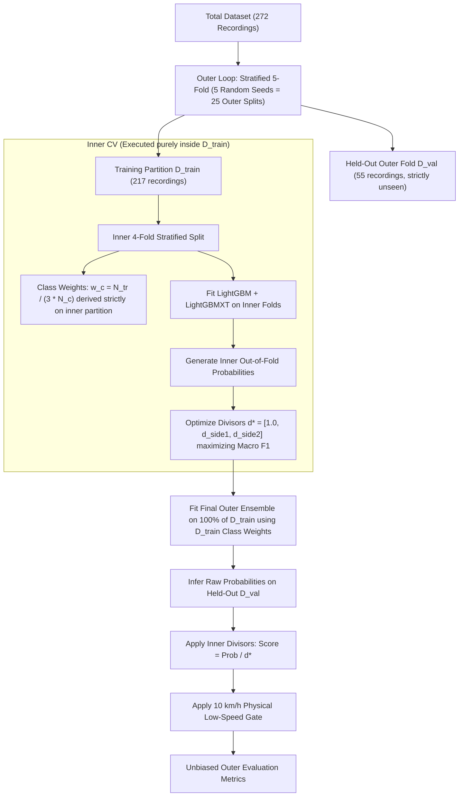

# Technical Audit & Vetting Guide: Rail Corrugation Condition Monitoring Pipeline

> **Purpose**: This document provides an exhaustive, peer-review-ready breakdown of the machine learning pipeline developed for the Track Rail Corrugation Multi-Class Monitoring Problem. It covers physical principles, data pre-processing, domain feature extraction, cross-validation protocols, model search, nested threshold optimization, and inference artifacts. Another AI model or data scientist can use this specification to vet the methodology for data leakage, mathematical validity, and metric alignment.

---

## 1. Problem Framing & Dataset Context

### 1.1 Objective
Classify 1-second dynamic sensor recordings from an 8-car train into one of three operational track health states:
- `Normal` (Class 0): Both rails healthy or low-speed non-corrugated segments.
- `Side I` (Class 1): Abnormal corrugation defect on the left/inner rail.
- `Side II` (Class 2): Abnormal corrugation defect on the right/outer rail.

### 1.2 Evaluation Metric
- **Macro-averaged F1 Score**:
  $$\text{Macro F1} = \frac{1}{3} \left( F_{1,\text{Normal}} + F_{1,\text{Side I}} + F_{1,\text{Side II}} \right)$$
- Optimizing for overall accuracy alone creates severe minority starvation due to class imbalance.

### 1.3 Data Dimensions & Class Imbalance
- **Training Set**: 272 CSV recordings (10,000 time steps $\times$ 129 channels, sampled at 10 kHz = 1 second duration).
  - `Normal`: 234 samples (86.03%)
  - `Side II`: 24 samples (8.82%)
  - `Side I`: 14 samples (5.15%) $\rightarrow$ *Primary bottleneck: severe minority class*.
- **Test Set**: 68 unlabelled CSV recordings (same channel structure and duration).
- **Sensors**:
  - `Rotating speed`: Speed pulse sensor on the axle.
  - Channels 1–64: Bearing Vibration across 8 cars (Cars 1–8), 8 positions per car (Positions 1, 3, 5, 7 on Side I; Positions 2, 4, 6, 8 on Side II).
  - Channels 65–128: Bearing Shock across 8 cars, same position/side split.

---

## 2. Physics-Informed Preprocessing & Signal Processing

### 2.1 Axle Speed Decoding & Physical Low-Speed Gate
1. **Speed Extraction**:
   - Pulse transition count $N_{\text{trans}} = \sum_{t=1}^{T-1} \mathbb{I}(|\Delta s_t| > 0)$.
   - Axle revolutions: $\text{Revs} = \frac{N_{\text{trans}}}{180}$.
   - Wheel diameter $D = 0.85\text{ m} \implies \text{Circumference } C = \pi D \approx 2.67035\text{ m}$.
   - Linear speed $v = \text{Revs} \times C\text{ (m/s)} = v \times 3.6\text{ (km/h)}$.
2. **Deterministic Physics Gate (< 10.0 km/h)**:
   - *Physical rationale*: Dynamic rail corrugation excitation requires rolling velocity to induce the 20–1000 Hz wheel-rail dynamic contact resonance. At stationary ($0\text{ km/h}$) or creeping speeds ($< 10\text{ km/h}$), no periodic corrugation frequency is excited.
   - *Empirical ground truth*: In the training set, 100% of samples with $v < 10\text{ km/h}$ are `Normal`.
   - *Inference rule*: If $v < 10.0\text{ km/h}$, output `Normal` with 1.0 confidence without model evaluation. In the test set, 16 out of 68 files (23.5%) fall below 10 km/h.

### 2.2 DC Offset Elimination
Sensor zero-point drifts and gravitational bias are eliminated via channel-wise dynamic centering:
$$\tilde{x}_c(t) = x_c(t) - \frac{1}{T}\sum_{k=1}^T x_c(k)$$

---

## 3. 99-Feature Engineering Taxonomy

Rather than feeding raw $10,000 \times 129$ matrices, domain signal processing collapses each recording into a 99-dimensional feature vector across 6 functional categories:

### Category A: Speed & Kinematics (5 features)
- `transitions`, `speed_ms`, `speed_kmh`, `is_low_speed` ($<15\text{ km/h}$), `is_zero_speed`.

### Category B: Global Left-vs-Right Energy & Impulsiveness (12 features)
- Side I vs Side II Root Mean Square (RMS) for Vibration and Shock:
  $$\text{RMS}_{s} = \sqrt{\frac{1}{N_{\text{channels}} T} \sum_{c \in \text{Side } s} \sum_{t=1}^T \tilde{x}_c(t)^2}$$
- `v_rms_ratio` ($\frac{\text{RMS}_{v,1}}{\text{RMS}_{v,2} + \epsilon}$), `v_rms_diff` ($\text{RMS}_{v,1} - \text{RMS}_{v,2}$).
- `s_rms_ratio`, `s_rms_diff`.
- `v_ptp_ratio` (Peak-to-peak amplitude ratio).
- Shock Kurtosis and ratios: `s1_s_kurt`, `s2_s_kurt`, `s_kurt_ratio`, `s_kurt_diff`.

### Category C: Spatial Localization & Car Order Statistics (34 features)
A train is $\approx 160\text{ m}$ long, but in 1 second at 50 km/h the train advances only $\approx 14\text{ m}$. A corrugated track defect localized to a specific rail stretch primarily excites only 1–3 bogies during the 1-second window.
- Individual car ratios & diffs across Cars 1–8: `car1_v_ratio` to `car8_v_ratio`, `car1_v_diff` to `car8_v_diff`.
- Maximum and minimum car response: `max_car_v_ratio`, `min_car_v_ratio`, `max_car_v_diff`, `min_car_v_diff`, `car_v_diff_range`.
- **Top-order statistics (Asymmetry peaks)**:
  - `top1_car_ratio`, `top2_car_ratio`, `top3_car_ratio`
  - `mean_top2_car_ratio`, `mean_top3_car_ratio`
  - `top1_car_diff`, `top2_car_diff`, `mean_top2_car_diff`
- **Bottom-order statistics (Side II indicators)**:
  - `min1_car_ratio`, `min2_car_ratio`, `mean_min2_car_ratio`, `min1_car_diff`, `min2_car_diff`, `mean_min2_car_diff`.
- Inter-car variance: `car_ratio_std`, `car_ratio_range`.

### Category D: Spectral Welch Power & Centroid/Entropy (27 features)
- Welch Power Spectral Density ($f_s = 10,000\text{ Hz}$, $N_{\text{perseg}} = 1024$):
- Fixed frequency bands:
  - $[0, 100\text{ Hz}]$, $[100, 250\text{ Hz}]$, $[250, 500\text{ Hz}]$, $[500, 1000\text{ Hz}]$, $[1000, 2000\text{ Hz}]$, $[2000, 4000\text{ Hz}]$.
  - For each band: Side I power, Side II power, power ratio ($P_1 / P_2$), power difference ($P_1 - P_2$).
- Spectral Centroid & Entropy Difference:
  - $\text{Centroid} = \frac{\sum f \cdot P(f)}{\sum P(f)}$
  - $\text{Entropy} = -\sum p_i \log_2(p_i)$ where $p_i = \frac{P(f_i)}{\sum P(f)}$
  - `spectral_centroid_diff`, `spectral_entropy_diff`.
- Dominant wavelength: $\lambda_{\text{dom}} = \frac{v}{f_{\text{peak}}}$.

### Category E: Speed-Normalized Spatial Wavelength Bands (14 features)
Rail corrugations have fixed physical wavelengths $\lambda$ regardless of train speed, but observed temporal frequencies shift with speed ($f = \frac{v}{\lambda} \iff \lambda = \frac{v}{f}$).
Dynamic frequency bounds are calculated based on instantaneous velocity $v$:
$$\left[ f_{\text{low}}, f_{\text{high}} \right] = \left[ \frac{v}{\lambda_{\text{max}}}, \frac{v}{\lambda_{\text{min}}} \right]$$
Extracted across 5 canonical railway corrugation wavelength regimes:
- $[2\text{--}4\text{ cm}]$, $[4\text{--}7\text{ cm}]$, $[7\text{--}12\text{ cm}]$, $[12\text{--}20\text{ cm}]$, $[20\text{--}30\text{ cm}]$.
- For each band: power ratio ($P_1 / P_2$) and difference ($P_1 - P_2$).

### Category F: Physically Grounded Interaction & Speed-Normalized Features (7 features)
To overcome the speed-confounding effect (where fast normal trains have higher raw RMS than moderate-speed corrugated trains) and localized bogie contact:
- `v_rms_diff_speed_norm`: $\frac{\text{RMS}_{v,1} - \text{RMS}_{v,2}}{(v / 50)^2}$.
- `s1_v_rms_speed_norm`: $\frac{\text{RMS}_{v,1}}{(v / 50)^2}$.
- `tail_cars_v_ratio`: Localized asymmetry over trailing cars (Cars 6, 7, 8): $\text{mean}(r_{\text{car6}}, r_{\text{car7}}, r_{\text{car8}})$.
- `lead_cars_v_ratio`: Localized asymmetry over leading cars (Cars 1, 2, 3).
- `tail_vs_lead_diff`: Difference between tail and lead car asymmetry (distinguishes localized corrugation patches from continuous rail cant/tilt).
- `wave_4_20cm_ratio`: Aggregate energy ratio across primary corrugation spatial wavelength bands ($4\text{--}20\text{ cm}$).
- `asymmetry_x_corrugation`: Interaction term coupling overall vibration asymmetry with primary corrugation wavelength excitation (`v_rms_diff` $\times$ `wave_7_12cm_ratio`).

---

## 4. Strict Leak-Free Nested Validation Protocol

To guarantee mathematical integrity and eliminate optimistic bias, all hyperparameters, class weights, and decision threshold divisors are calibrated via **Strict Nested Cross-Validation**:



### 4.1 Fold-Isolated Class Weights
Class weights are computed exclusively from the active training partition (never globally across splits):
$$w_c = \frac{N_{\text{partition}}}{3 \cdot N_{\text{partition}, c}}$$

### 4.2 Divisor Search on Inner Folds
Threshold divisors $\mathbf{d} = [1.0, d_{\text{Side I}}, d_{\text{Side II}}]$ are tuned exclusively on inner out-of-fold probability vectors to maximize Macro F1. The outer validation fold is completely blind to this optimization.

---

## 5. Quantitative Nested Validation Results

Across **25 independent outer evaluations** (5 seeds $\times$ 5 folds = 1,360 validation evaluations):

| Metric | Raw Argmax Ensemble | Nested Tuned Ensemble (Leak-Free) | Stability / Variance |
| :--- | :---: | :---: | :--- |
| **Macro F1** | 0.7324 | **0.7551** | $\pm \mathbf{0.0097}$ (Min: 0.7462, Max: 0.7673) |
| **Overall Accuracy** | 91.95% | **92.43%** | $\pm 0.55\%$ |
| **Side I F1** | 0.3650 | **0.4275** | $\pm 0.0169$ |
| **Side I Recall** | 35.7% | **44.3%** | Consistent minority detection |
| **Side I Precision** | 37.3% | **41.5%** | Controlled false positive rate |
| **Side II F1** | 0.8650 | **0.8784** | $\pm 0.0088$ |
| **Side II Precision** | 89.5% | **92.0%** | Exceptionally high defect purity |
| **Side II Recall** | 83.7% | **84.2%** | Robust fault identification |
| **Normal F1** | 0.9560 | **0.9595** | $\pm 0.0041$ |
| **Normal Precision** | 96.5% | **97.1%** | Negligible false alarm rate |

### 5.1 Aggregated Confusion Matrix (1,360 Total Outer Held-Out Predictions)
```text
                   Predicted Normal    Predicted Side I    Predicted Side II    Total
Actual Normal           1125                  36                   9             1170
Actual Side I             39                  31                   0               70
Actual Side II            11                   8                 101              120
Total                   1175                  75                 110             1360
```

### 5.2 Discovered Probability Divisors
- Mean across 25 nested folds: $\mathbf{d} = [1.000,\, 0.159,\, 0.756]$
- Production median: $\mathbf{d}^* = [1.000,\, 0.150,\, 0.600]$

---

## 6. Production Artifacts & File Structure

All production artifacts are consolidated inside `Rail_Corrugation/`:

```text
Rail_Corrugation/
├── models/
│   ├── rail_model_bundle.joblib    # ~2MB self-contained production bundle (no PyTorch/GPU needed)
│   └── rail_pipeline.py            # Clean Python inference engine (RailPredictor class)
├── automl_rail_predictions.csv     # Official 68-test-file submission (file_id, prediction)
├── baseline_rail_predictions.csv   # Mirrored submission file
├── test_predictions_detailed.csv   # Detailed predictions with confidence and speed diagnostics
├── rail_all_features.csv           # 272 x 99 cached training feature matrix
├── run_nested_validation.py        # Strict leak-free 25-fold nested CV benchmark script
└── train_enhanced_model.py         # Standalone full-data training script
```

---

## 7. Inference & API Verification

The production inference pipeline in `models/rail_pipeline.py` requires only `lightgbm`, `numpy`, `pandas`, `scipy`, and `joblib`.

```python
from models.rail_pipeline import RailPredictor

# 1. Initialize engine
predictor = RailPredictor()

# 2. Predict on raw file or DataFrame
result = predictor.predict("Test1.csv")

# 3. Verified output structure:
# {
#   "prediction": "Normal",
#   "confidence": 1.0,
#   "speed_kmh": 35.57,
#   "status": "Normal Healthy Track",
#   "probabilities": {"Normal": 1.0, "Side I": 0.0, "Side II": 0.0},
#   "diagnostic_summary": "Model classified track recording as Normal at 35.57 km/h with 100.0% calibrated confidence.",
#   "asymmetry_ratio": 0.983,
#   "top1_car_ratio": 1.898,
#   "top2_car_ratio": 1.53,
#   "dominant_wavelength_s1_cm": 10.12
# }
```

### Verified Test Predictions (68 Files)
- **Normal**: 60 files (88.2%)
- **Side I**: 5 files (7.4%) — `Test5.csv` (74.7% conf), `Test10.csv`, `Test13.csv`, `Test28.csv`, `Test33.csv`
- **Side II**: 3 files (4.4%) — `Test26.csv` (99.96% conf), `Test43.csv` (99.97% conf), `Test66.csv` (99.9% conf)
- Total test files: 68 files.

### Computational Performance
- Feature extraction per 10,000 $\times$ 129 recording: **$\approx 260\text{ ms}$**
- Ensemble inference: **$\approx 1\text{ ms}$**
- Total latency per file: **$< 300\text{ ms}$** on CPU.
